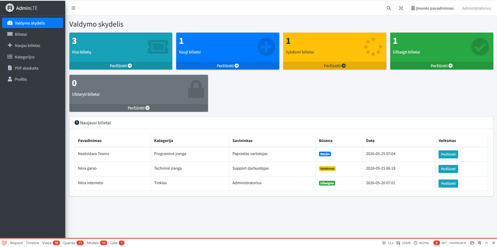

## Problemų (Ticket) registravimo ir sekimo sistema  sistema
Tai Laravel 12 pagrindu sukurta problemų registravimo ir sekimo sistema, skirta IT pagalbos bei kitų organizacijos problemų valdymui. Sistema leidžia vartotojams kurti problemų bilietus, stebėti jų būsenas bei gauti el. pašto pranešimus apie atliktus pakeitimus.
Programoje realizuota vartotojų autentifikacija, rolėmis pagrįstas prieigos valdymas, kategorijų klasifikatorius, komentarų sistema bei PDF ataskaitų generavimas. Vartotojo sąsaja sukurta naudojant AdminLTE administravimo šabloną ir MySQL duomenų bazę.

Darbą atliko: Rokas Giedraitis IST24 

### Valdymo skydelis

